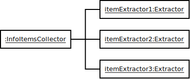

# Concept of the Extractor

## Collector/Extractor pattern

Before we can start coding our own service we need to understand the basic concept of the extractor. There is a pattern
you will find all over the code. It is called the __extractor/collector__ pattern. The idea behind it is that
the [extractor](https://teamnewpipe.github.io/NewPipeExtractor/javadoc/org/schabi/newpipe/extractor/Extractor.html)
would produce single pieces of data, and the collector would take it and form usable data for the front end out of it.
The collector also controls the parsing process, and takes care about error handling. So if the extractor fails at any
point the collector will decide whether it should continue parsing or not. This requires the extractor to be made out of
many small methods. One method for every data field the collector wants to have. The collectors are provided by NewPipe.
You need to take care of the extractors.

### Usage in the front end

So typical call for retrieving data from a website would look like this:
``` java
Info info;
try {
    // Create a new Extractor with a given context provided as parameter.
    Extractor extractor = new Extractor(some_meta_info);
    // Retrieves the data form extractor and builds info package.
    info = Info.getInfo(extractor);
} catch(Exception e) {
    // handle errors when collector decided to break up extraction
}
```

### Typical implementation of a single data extractor

The typical implementation of a single data extractor on the other hand would look like this:
``` java
class MyExtractor extends FutureExtractor {

    public MyExtractor(RequiredInfo requiredInfo, ForExtraction forExtraction) {
        super(requiredInfo, forExtraction);

        ...
    }

    @Override
    public void fetch() {
        // Actually fetch the page data here
    }

    @Override
    public String someDataFiled() 
        throws ExtractionException {    //The exception needs to be thrown if someting failed
        // get piece of information and return it
    }

    ...                                 // More datafields
}
```

## Collector/Extractor pattern for lists

Sometimes information can be represented as a list. In NewPipe a list is represented by a
[InfoItemsCollector](https://teamnewpipe.github.io/NewPipeExtractor/javadoc/org/schabi/newpipe/extractor/InfoItemsCollector.html).
A InfoItemCollector will collect and assemble a list of [InfoItem](https://teamnewpipe.github.io/NewPipeExtractor/javadoc/org/schabi/newpipe/extractor/InfoItem.html).
For each item that should be extracted a new Extractor must be created, and given to the InfoItemCollector via [commit()](https://teamnewpipe.github.io/NewPipeExtractor/javadoc/org/schabi/newpipe/extractor/InfoItemsCollector.html#commit-E-).



If you are implementing a list for your service you need to extend InfoItem containing the extracted information,
and implement an [InfoItemExtractor](https://teamnewpipe.github.io/NewPipeExtractor/javadoc/org/schabi/newpipe/extractor/Extractor.html)
that will return the data of one InfoItem.

A common Implementation would look like this:
```
private MyInfoItemCollector collectInfoItemsFromElement(Element e) {
    MyInfoItemCollector collector = new MyInfoItemCollector(getServiceId());

    for(final Element li : element.children()) {
        collector.commit(new InfoItemExtractor() {
            @Override
            public String getName() throws ParsingException {
                ...
            }

            @Override
            public String getUrl() throws ParsingException {
                ...
            }
            
            ...
    }
    return collector;
}

```

## InfoItems encapsulated in pages

When a streaming site shows a list of items it usually offers some additional information about that list, like it's title a thumbnail
or its creator. Such info can be called __list header__.

When a website shows a long list of items it usually does not load the whole list, but only a part of it. In order to get more items you may have to click on a next page button, or scroll down. 

This is why a list in NewPipe lists are chopped down into smaller lists called [InfoItemsPage](https://teamnewpipe.github.io/NewPipeExtractor/javadoc/org/schabi/newpipe/extractor/ListExtractor.InfoItemsPage.html)s. Each page has its own URL, and needs to be extracted separately.

Additional metainformation about the list such as its title a thumbnail
or its creator, and extracting multiple pages can be handled by a
[ListExtractor](https://teamnewpipe.github.io/NewPipeExtractor/javadoc/org/schabi/newpipe/extractor/ListExtractor.html),
and it's [ListExtractor.InfoItemsPage](https://teamnewpipe.github.io/NewPipeExtractor/javadoc/org/schabi/newpipe/extractor/ListExtractor.InfoItemsPage.html).

For extracting list header information it behaves like a regular extractor. For handling `InfoItemsPages` it adds methods
such as:

 - [getInitialPage()](https://teamnewpipe.github.io/NewPipeExtractor/javadoc/org/schabi/newpipe/extractor/ListExtractor.html#getInitialPage--)
   which will return the first page of InfoItems.
 - [getNextPageUrl()](https://teamnewpipe.github.io/NewPipeExtractor/javadoc/org/schabi/newpipe/extractor/ListExtractor.html#getNextPageUrl--)
   If a second Page of InfoItems is available this will return the URL pointing to them.
 - [getPage()](https://teamnewpipe.github.io/NewPipeExtractor/javadoc/org/schabi/newpipe/extractor/ListExtractor.html#getPage-java.lang.String-)
   returns a ListExtractor.InfoItemsPage by its URL which was retrieved by the `getNextPageUrl()` method of the previous page.


The reason why the first page is handled special is because many Websites such as YouTube will load the first page of
items like a regular webpage, but all the others as AJAX request.


