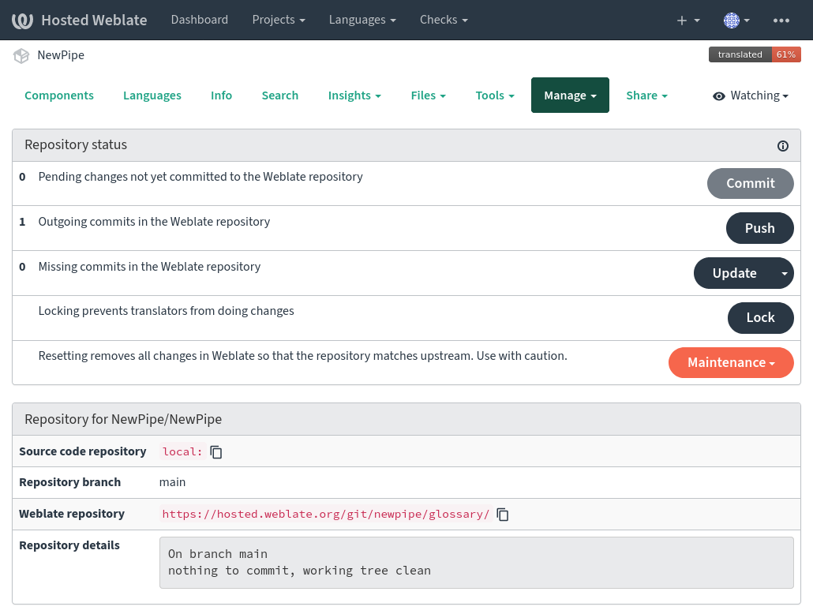

# Maintainers' Section

These are some basic principles that we want maintainers to follow when maintaining NewPipe.

### Keep it Streamlined
NewPipe is a media player for devices on the Android platform, thus it is intended to be used for entertainment. This means it does not have to be some professional
application, and it does not have to be complicated to be used.
However NewPipe might not focus on the casual user completely as there are
some features designed for more experienced users which may require some knowledge about
code, however in essence NewPipe should be easy to use, even for an average Android user.

1. __Don't add too many special
  features.__ NewPipe does not have to be an airplane cockpit. Do not try to fill every single niche that might exist. If people wanted more advanced features, they
  would use professional tools. If you add too much functionality, you add complexity, and complexity scares away the average user. Focus on NewPipe's scope as a **media player** for the end user, and only as such. 
2. __Usability of the user interface should be prioritized.__ Try to make it comply with
  [material design guidelines](https://material.io/design/guidelines-overview/).
  

### Bugfixes

]

*Disclaimer: This is a meme. Please don't take it personally.*

 __Always prioritize fixing bugs__, as the best application with the best features
   does not help much if it is broken, or annoying to use. Now if a program
   is in an early stage it is quite understandable that many things break. This
   is one reason why NewPipe still has no "1" in the beginning of its version
   number.
   By now, NewPipe is in a stage where there should be a strong focus on
   stability.

1. If there are multiple Pull Requests open, check the ones with bugfixes first.
2. Do not add too many features every version, as every feature will inevitably
    introduce more bugs. It is OK if PRs remain open for a while, but don't leave them open for too long.
3. If there are bugs that are stale, or open for a while bump them from time
   to time, so devs know that there is still something left to fix.
4. Never merge PRs with known issues. From our perception the community does not like to fix bugs, this is why you as a maintainer should
   especially focus on pursuing bugs.

### Features

Features are also something that can cause a headache. You should not blindly
say yes to features, even if they are small, but you should also not immediately say no. If you are not sure, try the feature, look into the
code, speak with the developer, and then make a decision. When considering a feature, ask yourself the following questions:

- Was the feature requested by only a few, or by many?
	- Avoid introducing niche features to satisfy a small handful of users.
- Was the code rushed and messy, and could a cleaner solution be made?	
	- A pull request that adds a frequently requested feature could implement the feature in a messy way. Such PRs should not be merged as it will likely cause problems later down the line, either through problems of extending the feature by introducing many bugs, or simply by breaking the architecture or the philosophy of NewPipe.
- Does the amount of code justify the feature's purpose? 
	- Use critical thinking when considering new features and question
whether that features makes sense, is useful, and if it would benefit NewPipe's users.

### Pull Requests

If a PR contains more than one feature/bugfix, be cautious. The more stuff a PR changes, the longer it will take to be added.
There also might be things that seem to not have any issues, but other things will, and this would prevent you from merging a PR. This is why it is encouraged to keep one change per pull request, and you should insist that contributors divide such PRs into multiple smaller PRs when possible.

### Community

When you talk to the community, stay friendly and respectful with good etiquette.
When you have a bad day, just don't go to GitHub (advice from our experience ;D ).

### Managing translations via Weblate
NewPipe is translated via [Weblate](https://hosted.weblate.org/projects/newpipe).
There are two different components which are open for translation:

- The app [`strings`](https://hosted.weblate.org/projects/newpipe/strings/).
- The fastlane [metadata](https://hosted.weblate.org/projects/newpipe/metadata/);
  this includes the F-Droid store description and changelogs.

Maintainers can access more options to handle Weblate via the
[Manage > Repository Maintenance](https://hosted.weblate.org/projects/newpipe/#repository) button
or via the [Weblate CLI](https://docs.weblate.org/en/latest/wlc.html#wlc). These options include
basic access to Git operations like commit and rebase
as well as locking Weblate to prevent further changes to translations.

`HINT: When updating Weblate via the web interface, please use the "Update > Rebase" option.`

#### Update Weblate

Weblate is based on NewPipe's `dev` branch and is configured to automatically update its repository to be in sync with NewPipe.
However, Weblate does not update its branch often, therefore it is better to update it manually after changing strings in NewPipe.

To do thus manually, commit the Weblate changes and rebase the repository.
Sometimes conflicts need to be resoled while rebasing the repository.
Conflicts need to be addressed ASAP, because Weblate is automatically locked once conflicts occur.
To do so, [merge the changes from Weblate into NewPipe](#merge-changes-from-weblate-into-newpipe).
If Weblate does not recognize the new commit by itself, ask Weblate to rebase once more.
Weblate unlocks the translations when all conflicts are resolved and no errors are detected.

#### Merge changes from Weblate into NewPipe
Weblate does not push the translation changes to NewPipe automatically.
Doing this manually, allows the maintainers to do a quick review of the changes.

Before merging weblate changes into NewPipe, make sure to commit all Weblate changes and
lock the Weblate to prevent modifications while you update Weblate.
To merge the changes into NewPipe, checkout Weblate's `dev` branch.
You have read access to Weblate's repository via `https://hosted.weblate.org/git/newpipe/strings/`.
If there are conflicts when rebasing weblate, resolve them.

Check the following things:
- Is there a translation for a new language? If yes, [register the language with the app's langauge selector](https://github.com/TeamNewPipe/NewPipe/pull/5721)
- Use `Analyse > Inspect Code` in Android Studio to find unused strings and potential bugs introduced by Weblate.
  Pay attention to plurals in Asian languages. They are broken by Weblate on a regular basis.

Push the changes to NewPipe's `dev` branch, [update Weblate](#update-weblate) and unlock it.
